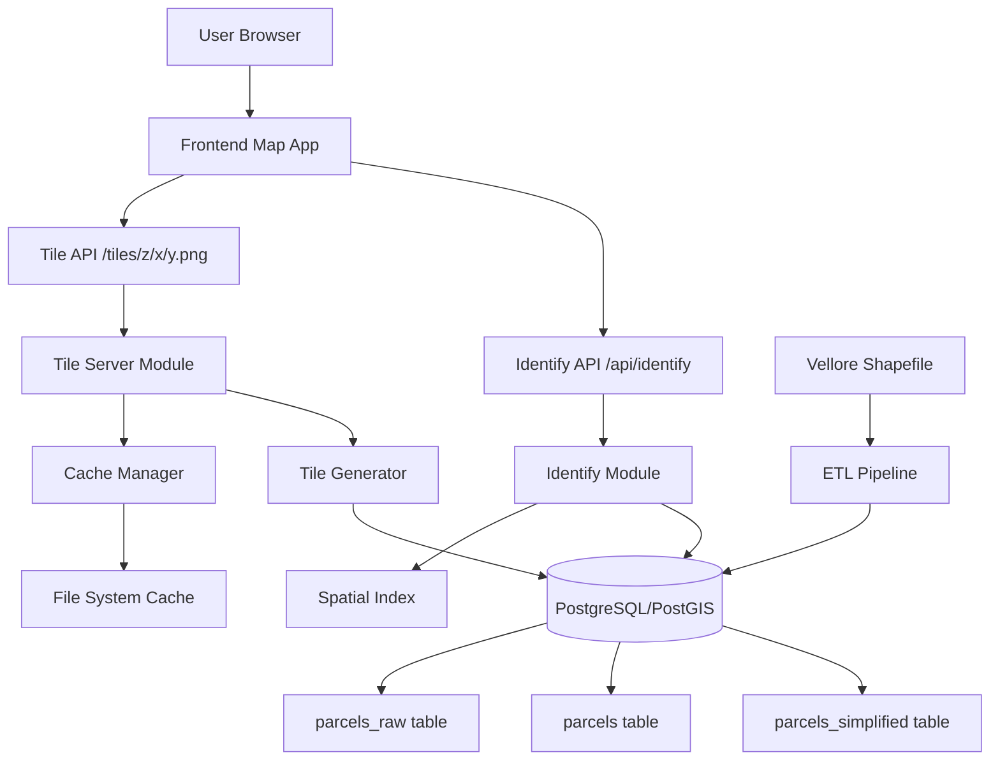
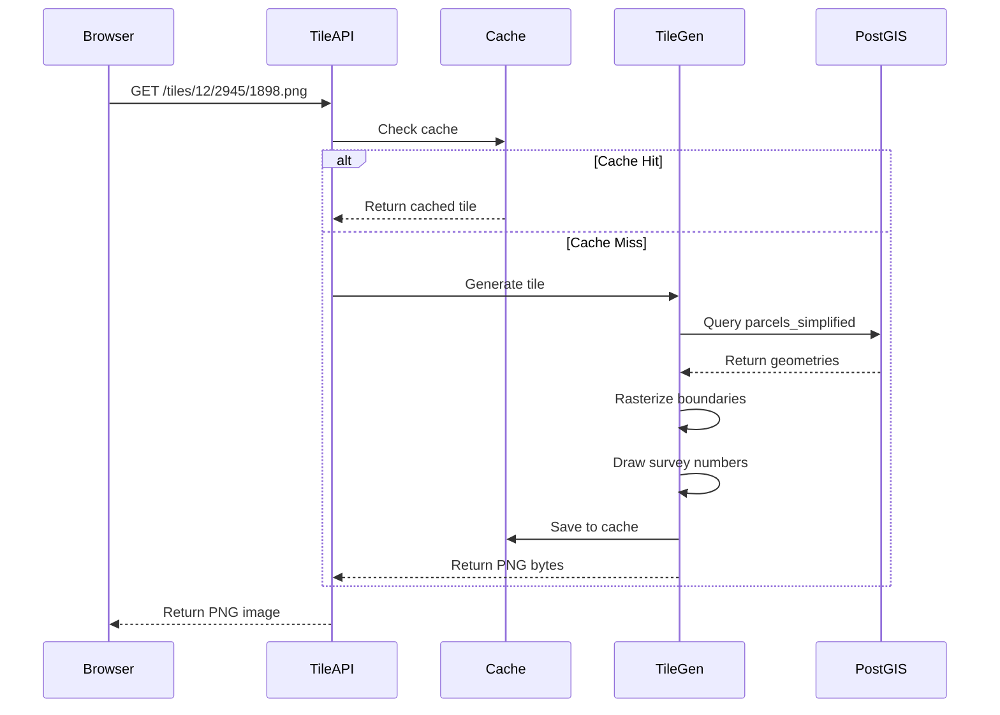
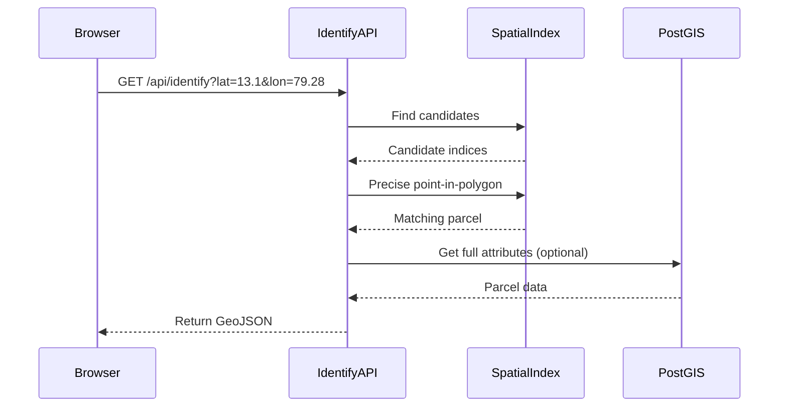

# System Architecture

## Overview

Parcel MVP follows a three-tier architecture: Frontend (client-side map), Backend API (FastAPI), and Database (PostgreSQL/PostGIS). The system generates map tiles on-demand and caches them for performance.

## Architecture Diagram

## Component Details

### 1. Frontend Layer

**Location**: `frontend/map-app/index.html`

- **Technology**: Leaflet.js for map rendering
- **Responsibilities**:
  - Display base map (OpenStreetMap)
  - Overlay parcel raster tiles
  - Handle user clicks
  - Query identify API
  - Display parcel highlights

**Key Features**:
- Two tile layers: OSM basemap + parcel overlay
- Click event handler that calls `/api/identify`
- GeoJSON rendering for highlighted parcels

### 2. Backend API Layer

**Location**: `backend/main.py`

FastAPI application that routes requests to specialized modules:

#### 2.1 Tile Server Module

**Location**: `backend/tile_server/tile_server_raster.py`

**Responsibilities**:
- Serve raster PNG tiles at `/tiles/{z}/{x}/{y}.png`
- Check cache before generating
- Generate tiles on-demand using PostGIS queries
- Cache generated tiles to filesystem

**Flow**:
1. Receive tile request (z, x, y)
2. Check cache (`backend/cache/z/x/y.png`)
3. If cached, return cached tile
4. If not cached:
   - Query PostGIS for parcels in tile bounds
   - Generate 256x256 PNG with parcel boundaries
   - Render survey numbers as text labels
   - Save to cache
   - Return tile

**Dependencies**:
- `backend/tile_server/utils/generate_tile.py`: Tile generation logic
- `backend/tile_server/utils/cache_manager.py`: Cache operations
- `backend/tile_server/utils/tile_utils.py`: Coordinate transformations

#### 2.2 Identify Module

**Location**: `backend/identify_api/identify_server.py`

**Responsibilities**:
- Handle parcel identification requests at `/api/identify`
- Find parcel containing given lat/lon coordinates
- Return parcel geometry and attributes

**Flow**:
1. Receive lat/lon coordinates
2. Use spatial index for fast candidate selection
3. Perform precise point-in-polygon check
4. Return parcel data as GeoJSON

**Dependencies**:
- `backend/identify_api/utils/spatial_index.py`: In-memory spatial index
- `backend/identify_api/utils/query_parcel.py`: Query logic

### 3. Database Layer

**Location**: PostgreSQL database `parcels_db`

#### Tables

**parcels_raw**
- Complete original data with all shapefile attributes
- Used for detailed parcel information queries
- Columns: parcel_uuid, geom, kide, kide_1, kide_2, survey_num, gp_name, v_name, v_code, district, state, tehsil

**parcels**
- Cleaned subset with essential attributes
- Used for general queries
- Columns: parcel_uuid, geom, district, tehsil, v_name, survey_num

**parcels_simplified**
- Original geometries (not simplified) for maximum precision
- Used for tile generation
- Columns: parcel_uuid, geom, survey_num, state_code, district_code, label_point
- Note: Despite the name, contains original geometry (simplification disabled)

### 4. ETL Pipeline

**Location**: `etl/pipeline.py` (new modular ETL) and `etl/load_vellore.py` (legacy, deprecated)

**New Modular ETL Architecture**:
- **Orchestrator**: `etl/pipeline.py` - CLI entry point, coordinates all steps
- **Extract Module**: `etl/modules/extract.py` - Loads shapefiles, inspects data
- **Transform Module**: `etl/modules/transform.py` - Maps fields, cleans geometries, computes label_point
- **Validate Module**: `etl/modules/validate.py` - Data quality checks
- **Load Module**: `etl/modules/load.py` - Batch inserts into database
- **Geometry Utils**: `etl/modules/geometry_utils.py` - Low-level geometry operations

**Configuration**: YAML-based (`etl/config/vellore_mapping.yaml`) for field mappings and transformations

**Process** (New ETL):
1. Load configuration from YAML
2. Extract: Load shapefile using GeoPandas
3. Validate: Check source data quality
4. Transform: 
   - Map fields according to config
   - Apply transformations (e.g., int64 → string)
   - Clean geometries (buffer(0) for invalid, convert Polygon to MultiPolygon)
   - Compute label_point (ST_PointOnSurface) - **moved from tile generation**
5. Validate: Check transformed data
6. Load: Batch insert into `parcels_master` (UUID auto-generated by DB)
7. Load: Batch insert into `parcels_simplified` (original geometries, not simplified)

**Key Improvements**:
- Configuration-driven (YAML) instead of hardcoded
- Modular, testable components
- Pre-computed label_point (better performance)
- Database-generated UUIDs
- Targets partitioned tables for scalability

## Data Flow

### Tile Request Flow

### Identify Request Flow

## Spatial Indexing Strategy

### In-Memory Index (Identify API)

**Location**: `backend/identify_api/utils/spatial_index.py`

- Loads all parcels into GeoPandas GeoDataFrame at startup
- Builds R-tree spatial index
- Used for fast candidate selection
- Two-stage query: spatial index → precise geometry check

### Database Index (Tile Server)

- PostGIS spatial indexes on geometry columns
- Automatic GIST indexes on PostGIS geometry columns
- Used for bounding box queries in tile generation

## Caching Strategy

**Location**: `backend/tile_server/utils/cache_manager.py`

- **Storage**: Filesystem cache in `backend/cache/`
- **Structure**: `cache/{z}/{x}/{y}.png`
- **Strategy**: Check cache first, generate if missing, save after generation
- **Benefits**: Reduces database load and tile generation time

## Coordinate Systems

- **Input Data**: EPSG:4326 (WGS84 lat/lon)
- **Tiles**: Web Mercator (EPSG:3857) tile scheme
- **Transformations**: Handled in `backend/tile_server/utils/tile_utils.py`

## Performance Considerations

1. **Tile Caching**: Reduces regeneration overhead
2. **Geometry Simplification**: Faster rendering at lower zoom levels
3. **Spatial Indexes**: Fast spatial queries
4. **Separate Tables**: Optimized for different use cases
5. **Connection Pooling**: AsyncPG pool for vector tiles (future)

## Scalability

Current architecture supports:
- Single server deployment
- File-based tile caching
- In-memory spatial index (limited by RAM)

Future enhancements:
- CDN for tile distribution
- Redis for tile caching
- Database connection pooling
- Distributed tile generation

## Security Considerations

- CORS enabled for all origins (development)
- No authentication (MVP stage)
- Database credentials in code (should use environment variables)

## Related Documentation

- [API.md](API.md) - API endpoint details
- [DATABASE.md](DATABASE.md) - Database schema
- [TILES.md](TILES.md) - Tile generation details
- [SPATIAL_QUERIES.md](SPATIAL_QUERIES.md) - Spatial query patterns

