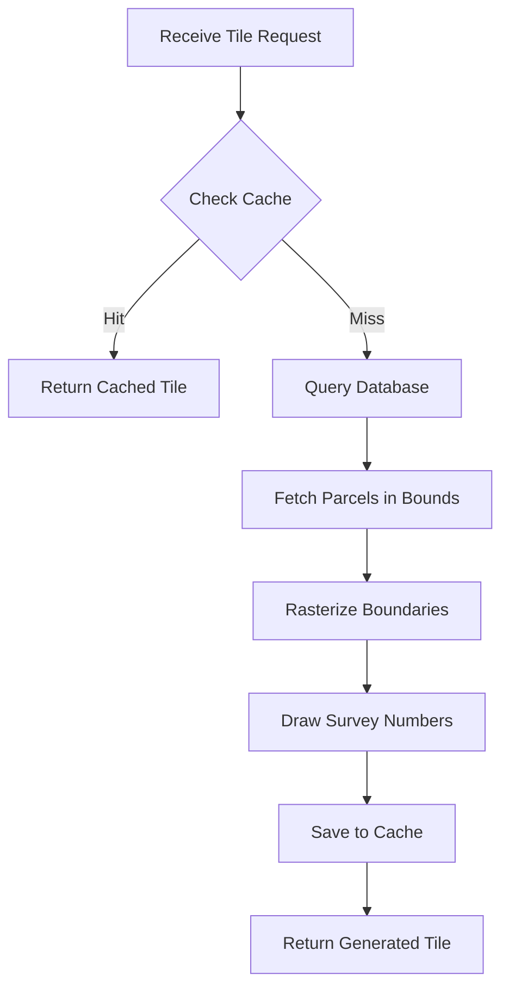

# Tile Generation Documentation

## Overview

The Parcel MVP generates raster PNG tiles on-demand for map display. Tiles show parcel boundaries and survey number labels, and are cached for performance.

## Tile Specification

### Standard Web Map Tiles

- **Format**: PNG (Portable Network Graphics)
- **Size**: 256x256 pixels
- **Coordinate System**: Web Mercator (EPSG:3857) tile scheme
- **Scheme**: XYZ (Google/OSM standard)
- **Zoom Levels (active)**: 15-18 (frontend requests + backend enforced)

### Tile Coordinates

Tiles are identified by three integers:
- **z** (zoom): Zoom level (0 = world, higher = more detail)
- **x**: Tile column (0 to 2^z - 1)
- **y**: Tile row (0 to 2^z - 1)

**Example**: `tiles/12/2945/1898.png` = zoom 12, column 2945, row 1898

## Tile Generation Process

### Endpoint

**URL**: `GET /tiles/{z}/{x}/{y}.png`

**Implementation**: `backend/tile_server/tile_server_raster.py`

**Zoom guard**: The backend rejects requests where `z < 15` or `z > 18` with HTTP 400 to avoid generating unwanted tiles.

### Generation Flow



### Step-by-Step Process

1. **Receive Request**: Extract z, x, y from URL (only 15-18 served)
2. **Check Cache**: Look for existing tile in `backend/cache/{z}/{x}/{y}.png`
3. **If Cached**: Return cached PNG file
4. **If Not Cached**:
   - Convert tile coordinates to geographic bounds
   - Query database for parcels in bounds
   - Generate PNG image
   - Save to cache
   - Return PNG

## Coordinate Transformation

### Tile to Geographic Bounds

**Function**: `tile_xyz_to_bounds()` in `backend/tile_server/utils/tile_utils.py`

**Input**: z, x, y tile coordinates

**Output**: (minx, miny, maxx, maxy) in EPSG:4326

**Algorithm**:
```python
n = 2.0 ** z
lon_min = x / n * 360.0 - 180.0
lon_max = (x + 1) / n * 360.0 - 180.0

lat_min = math.degrees(math.atan(math.sinh(math.pi * (1 - 2 * (y + 1) / n))))
lat_max = math.degrees(math.atan(math.sinh(math.pi * (1 - 2 * y / n))))
```

### Geographic to Pixel Coordinates

For rendering labels:
```python
px = int((point.x - minx) / (maxx - minx) * 256)
py = int((maxy - point.y) / (maxy - miny) * 256)  # Y-flip for image
```

## Database Query

### Query for Tile Parcels

**Location**: `backend/tile_server/utils/generate_tile.py` (lines 38-46)

```sql
SELECT parcel_uuid,
       survey_num,
       ST_AsEWKB(geom),
       ST_AsEWKB(ST_PointOnSurface(geom)) AS label_point
FROM parcels_simplified
WHERE geom && ST_MakeEnvelope(%s, %s, %s, %s, 4326)
  AND ST_Intersects(geom, ST_MakeEnvelope(%s, %s, %s, %s, 4326));
```

**Optimization**:
- Uses `&&` (bounding box operator) for fast index-based filtering
- Uses `ST_Intersects` for precise geometry check
- Queries `parcels_simplified` table (faster than full geometries)

## Rasterization

### Boundary Rendering

**Library**: Rasterio `features.rasterize()`

**Process**:
1. Create edge mask from parcel boundaries
2. Rasterize boundaries to 256x256 array
3. Convert to RGBA image

**Code** (lines 90-97):
```python
transform = from_bounds(minx, miny, maxx, maxy, 256, 256)
edge_mask = features.rasterize(
    [(p["geometry"].boundary, 1) for p in tile_parcels],
    out_shape=(256, 256),
    transform=transform,
    fill=0,
    dtype=np.uint8
)
```

### Image Creation

**Library**: PIL/Pillow, NumPy

**Process**:
1. Create RGBA array (256x256x4)
2. Set boundary pixels to black (0, 0, 0, 255)
3. Set background to transparent (0, 0, 0, 0)
4. Convert to PIL Image

**Code** (lines 99-103):
```python
rgba = np.zeros((256, 256, 4), dtype=np.uint8)
rgba[..., 0] = np.where(edge_mask == 1, 0, rgba[..., 0])  # R
rgba[..., 1] = np.where(edge_mask == 1, 0, rgba[..., 1])   # G
rgba[..., 2] = np.where(edge_mask == 1, 0, rgba[..., 2])   # B
rgba[..., 3] = np.where(edge_mask == 1, 255, 0)            # A
```

## Label Rendering

### Survey Number Labels

**Library**: PIL ImageDraw

**Process**:
1. For each parcel, get label point (`ST_PointOnSurface`)
2. Convert geographic coordinates to pixel coordinates
3. Draw text at pixel location

**Code** (lines 111-116):
```python
img = Image.fromarray(rgba, "RGBA")
draw = ImageDraw.Draw(img)

for p in tile_parcels:
    point = p["label_point"]
    px = int((point.x - minx) / (maxx - minx) * 256)
    py = int((maxy - point.y) / (maxy - miny) * 256)
    draw.text((px, py), str(p["survey_num"]), fill="black")
```

**Label Point**: Uses `ST_PointOnSurface()` to get point inside polygon

## Caching

### Cache Structure

**Directory**: `backend/cache/`

**Structure**: `cache/{z}/{x}/{y}.png`

**Example**: `cache/12/2945/1898.png`

### Cache Operations

**Location**: `backend/tile_server/utils/cache_manager.py`

**Functions**:
- `get_tile_from_cache(z, x, y)`: Check and retrieve cached tile
- `save_tile_to_cache(z, x, y, tile_data)`: Save tile to cache

**Implementation**:
```python
def _tile_path(z: int, x: int, y: int) -> str:
    return os.path.join(CACHE_DIR, str(z), str(x), f"{y}.png")

def get_tile_from_cache(z: int, x: int, y: int) -> bytes | None:
    tile_path = _tile_path(z, x, y)
    if os.path.exists(tile_path):
        with open(tile_path, "rb") as f:
            return f.read()
    return None

def save_tile_to_cache(z, x, y, tile_data):
    tile_path = _tile_path(z, x, y)
    os.makedirs(os.path.dirname(tile_path), exist_ok=True)
    with open(tile_path, "wb") as f:
        f.write(tile_data)
```

### Cache Benefits

- Reduces database queries
- Faster tile delivery
- Lower server load
- Better user experience

### Cache Management

**Clearing Cache**:
```bash
rm -rf backend/cache/*
```

**Cache Size**: Monitor disk usage, especially at high zoom levels

**Cache Warming**: Pre-generate tiles for common areas/zoom levels

## Empty Tiles

If no parcels intersect a tile:

**Response**: Transparent 256x256 PNG

**Code** (lines 80-85):
```python
if not tile_parcels:
    img = Image.new("RGBA", (256, 256), (255, 255, 255, 0))
    buf = io.BytesIO()
    img.save(buf, format="PNG")
    return buf.getvalue()
```

## Performance Considerations

### Optimization Strategies

1. **Simplified Geometries**: Use `parcels_simplified` table
2. **Spatial Indexes**: PostGIS GIST indexes on geometry columns
3. **Bounding Box Filter**: Use `&&` before `ST_Intersects`
4. **Caching**: Avoid regeneration of existing tiles
5. **Label Optimization**: Only render visible labels (future)

### Performance Metrics

- **Cache Hit**: < 10ms (file read)
- **Cache Miss**: 100-500ms (generation time)
- **Database Query**: 10-50ms (depends on parcel count)
- **Rasterization**: 50-200ms (depends on geometry complexity)

## Tile Styling

### Current Styling

- **Boundaries**: Black (RGB: 0, 0, 0)
- **Background**: Transparent
- **Labels**: Black text
- **Label Font**: Default system font

### Customization

Edit `backend/tile_server/utils/generate_tile.py`:

**Change Boundary Color**:
```python
rgba[..., 0] = np.where(edge_mask == 1, 255, rgba[..., 0])  # Red
rgba[..., 1] = np.where(edge_mask == 1, 0, rgba[..., 1])     # Green
rgba[..., 2] = np.where(edge_mask == 1, 0, rgba[..., 2])     # Blue
```

**Change Label Style**:
```python
from PIL import ImageFont

font = ImageFont.truetype("arial.ttf", 12)
draw.text((px, py), str(p["survey_num"]), fill="blue", font=font)
```

## Vector Tiles (Alternative)

**Location**: `backend/tile_server/tile_server_vector.py`

**Format**: Mapbox Vector Tiles (MVT) in protobuf format

**Endpoint**: `GET /tiles/{z}/{x}/{y}.pbf`

**Status**: Implemented but not integrated into main router

**Benefits**:
- Smaller file sizes
- Client-side styling
- Better scalability

## Related Documentation

- [API.md](API.md) - API endpoint details
- [SPATIAL_QUERIES.md](SPATIAL_QUERIES.md) - Spatial query patterns
- [ARCHITECTURE.md](ARCHITECTURE.md) - System architecture

